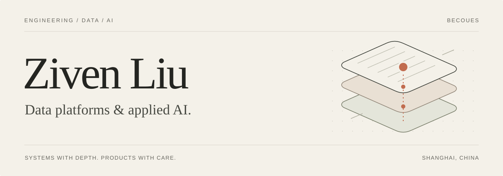

<picture>
  <source media="(prefers-color-scheme: dark)" srcset="./assets/header-dark.svg">
  
</picture>

 

I build and operate **data platforms**, connecting ingestion and lakehouse modeling with business metrics, application data, and AI-assisted analytics.

My work spans system design, implementation, production operations, and the analysis that makes the data useful.

[Website & writing](https://ziven.cloud/en/) &nbsp; ↗ &nbsp;&nbsp; [All repositories](https://github.com/Becoues?tab=repositories) &nbsp; ↗

 

## Selected work

### 01 &nbsp; Production lakehouse engineering

Build and operate a layered lakehouse with Dagster, dbt, Spark, and Iceberg, turning application and payment data into reusable analytical models.

The work spans incremental processing, partitioned backfills, data quality checks, and production delivery on Kubernetes through GitOps.

DAGSTER &nbsp; / &nbsp; DBT &nbsp; / &nbsp; SPARK &nbsp; / &nbsp; ICEBERG &nbsp; / &nbsp; KUBERNETES

### 02 &nbsp; Change data capture & operational serving

Develop PostgreSQL CDC ingestion and publish warehouse-derived user attributes to application-facing data stores.

Handle snapshot/change ordering, deletion semantics, and event deduplication. Deliver attributes to DynamoDB through validated imports and versioned table cutovers, retaining the previous version for recovery.

POSTGRESQL &nbsp; / &nbsp; AWS DMS &nbsp; / &nbsp; KINESIS &nbsp; / &nbsp; DYNAMODB

### 03 &nbsp; Subscription metrics & product research

Define subscription, retention, and revenue metrics across billing sources, reconciling currency units, transaction timing, and payment states.

Investigate churn through cohort and behavioral analysis, with complete observation windows and explicit leakage checks. Deliver traceable datasets, dashboards, and written findings for product, finance, and audit work.

SQL &nbsp; / &nbsp; DATA MODELING &nbsp; / &nbsp; RECONCILIATION &nbsp; / &nbsp; COHORT ANALYSIS

### 04 &nbsp; Governed analytics & AI access

Deploy and extend Superset for shared analytics, with MCP access tied to individual user identities and existing role-based permissions.

Implement credential issuance, expiry, and revocation, and validate identity isolation across concurrent requests. Agent access follows the same Superset permissions as interactive use.

SUPERSET &nbsp; / &nbsp; MCP &nbsp; / &nbsp; RBAC &nbsp; / &nbsp; PYTHON &nbsp; / &nbsp; ARGO CD

 

## Engineering focus

| Area | What I work with |
| :--- | :--- |
| **Data platforms** | Python, SQL, Dagster, dbt, Spark, Iceberg · orchestration, incremental models, data quality |
| **Ingestion & serving** | PostgreSQL, DMS, Kinesis, DynamoDB · change capture, state reconstruction, application data delivery |
| **Analytics & AI** | Superset, MCP, cohort analysis · metric definitions, reconciliation, governed data access |
| **Platform operations** | Kubernetes, Helm, Argo CD, GitHub Actions · GitOps, deployment checks, environment isolation |

 

## Notes & experiments

I write about data systems and share what I learn while building. Explore the notes and experiments on my [personal site](https://ziven.cloud/en/).

 

---

Based in Shanghai &nbsp; · &nbsp; Building across data, AI, and the interface between them.
